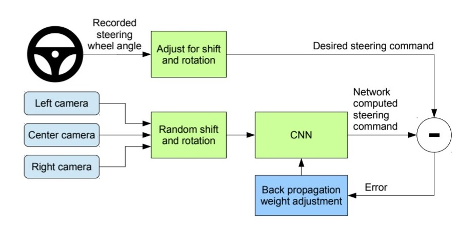
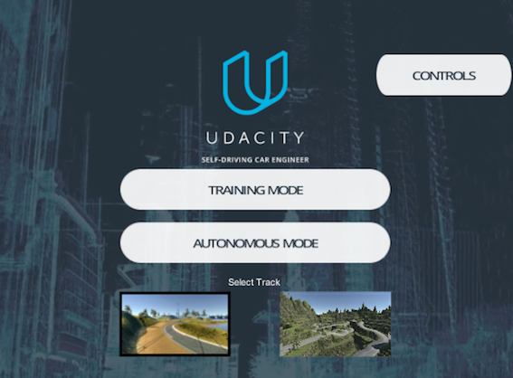
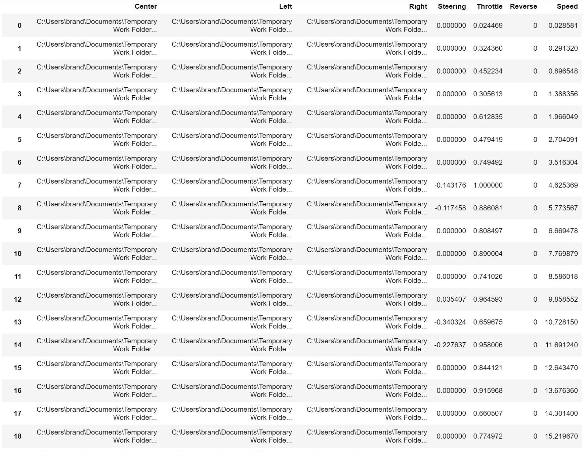
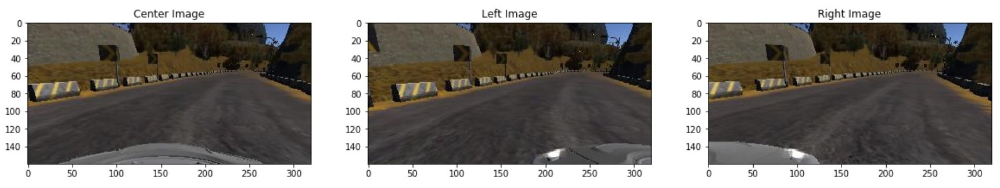
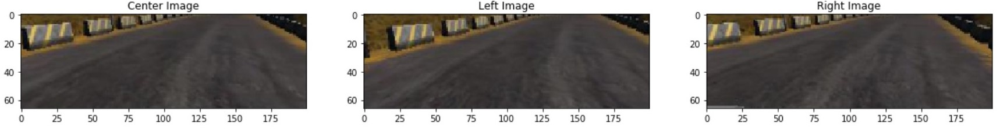
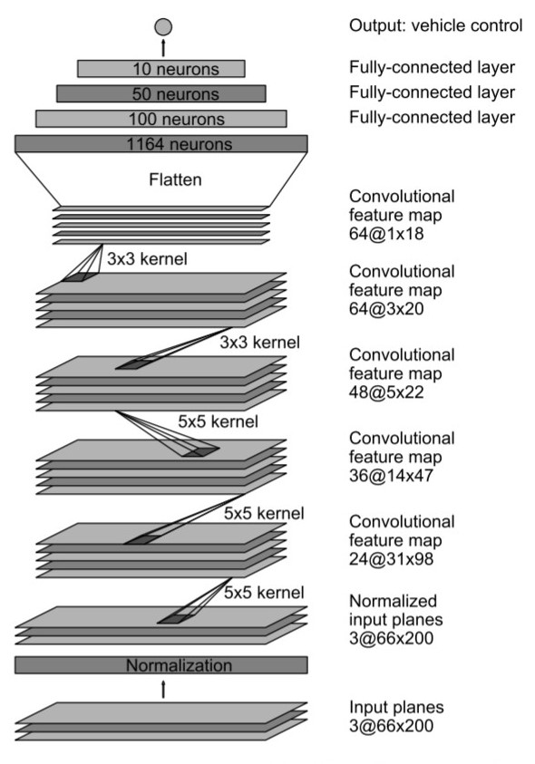
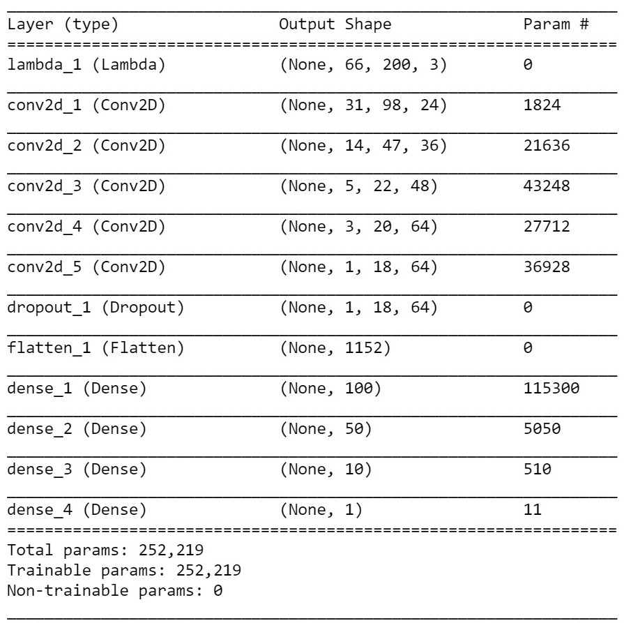
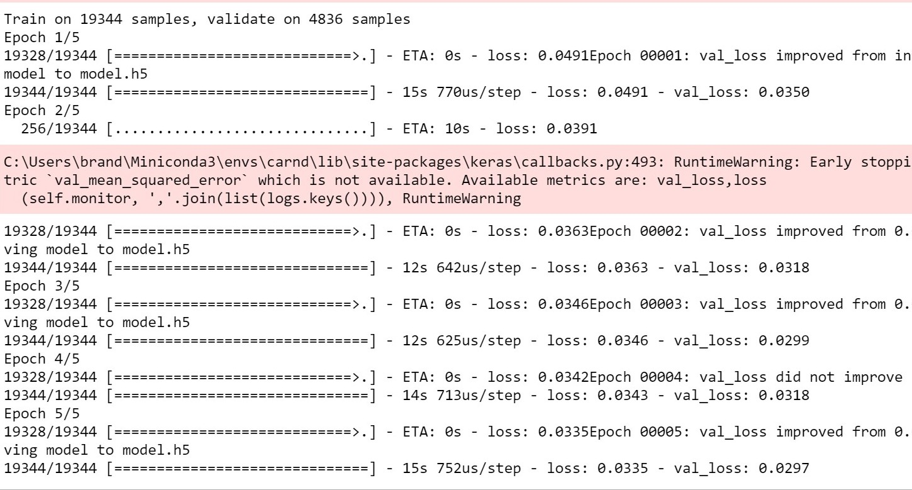

# **Behavioral Cloning** 
---

**Behavioral Cloning Project**

The goals / steps of this project are the following:
* Use the simulator to collect data of good driving behavior
* Build, a convolution neural network in Keras that predicts steering angles from images
* Train and validate the model with a training and validation set
* Test that the model successfully drives around track one without leaving the road

This project is done based on NVIDIA's End-To-End Deep Learning for Self-Driving Cars which can be found [in this link] and a [video here].

[video here]: https://www.youtube.com/watch?v=NJU9ULQUwng
[in this link]: https://devblogs.nvidia.com/deep-learning-self-driving-cars/

Method
---

### Model Architecture and Training Strategy

### Use the simulator to collect data of good driving behavior

To collect the good driving behavior data, we use a simulator provided by Udacity. It can be downloaded from [here]. There are two different tracks which we can perform our behavioral cloning in which they are of different difficulties. At the beginning, the training data can be collected by clicking on the recording button and have the training data saved into a data folder. The data saved will be in form of a csv file. The csv file will contain few information separated by comma, eg. Center Camera Image, Left Camera Image, Right Camera Image, Steering Angle, Acceleration and Braking.

Summary of the data
---

[here]: https://d17h27t6h515a5.cloudfront.net/topher/2016/November/5831f3a4_simulator-windows-64/simulator-windows-64.zip

### Pre-processing the data
The pre-processing sequence is first to crop the top and the bottom of the image to remove the sky and the part of the bonnet to improve the accuracy of the neural network. The pipeline is followed by a resize to (66,200,3) as stated by the NVIDIA's CNN input shape. Color space change to the YUV format is optional as there hasn't been much improvement at least in this simulation's case.

Original:
---

Tweaked:
---

### Data augmentation
The data available were mostly a right turn, so we balance out the distribution by augmentating the images collected.
The only augmentation technique used as this is enough to train the vehicle to make few complete laps.
1. Flipping the image and flipping the steering angle data

Of course, in the real world, different data augmentation techniques should be used so that the neural network will be able to generalize more. Examples would be:
1. Flipping
2. Rotation
3. Shearing
4. Translation
5. Adding random shadows
6. Adding random color tint
7. Adding random image distortion

### Model Architecture

The model employed is based and tweaked on NVIDIA's DAVE-2 CNN network. This model is used as a base reference as it has been proven a working model in this particular application. The summary of the NVIDIA model is as below:

Model used
---

### Training

The model is splitted into 80:20 for training and validation. The model contains one 50% dropout layer right before the dense layer in order to reduce overfitting. The model used an adam optimizer, so the learning rate was not tuned manually.
I finally randomly shuffled the data and run the training for 10 epochs, 128 batch size and ran the data on a GTX 1050.

Result
---

